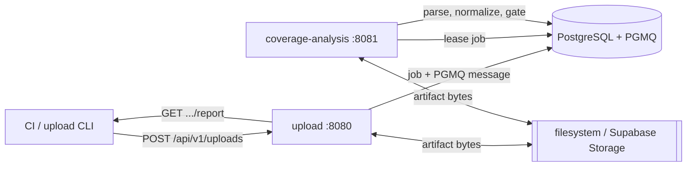

# Vericov

**Open-source, self-hosted coverage backend.** Ship coverage and test results
from CI, get normalized reports and policy gates — on your own infrastructure,
backed by your own PostgreSQL or the database that ships in the box.

[](https://github.com/Harshal96/vericov/actions/workflows/ci.yml)
[](LICENSE)


> **Project status:** pre-1.0. The core services and upload CLI are usable, but
> APIs and database schemas may still change between releases.

## Features

- Upload coverage and test-result artifacts from CI.
- Parse LCOV, JaCoCo, Cobertura, Clover, Go cover, gcov, and llvm-cov output.
- Exclude generated or vendored source files with ordered rules in
  `.vericov.yml`.
- Store normalized reports, line hits, test runs, coverage gaps, and gates.
- Run with an integrated PostgreSQL database or bring your own compatible
  PostgreSQL instance.
- Start without an external auth provider on a trusted private network.
- Use shared filesystem storage by default or Supabase Storage when preferred.

## Quick Start

Prerequisites: Git, Docker, and Docker Compose.

```bash
git clone https://github.com/Harshal96/vericov.git
cd vericov
./vericov init
./vericov doctor
./vericov up
```

The bundled database initializes the tracked Vericov schema and PGMQ queues on
first boot. Services bind to `127.0.0.1` by default.

Verify the stack:

```bash
./scripts/smoke-test.sh
```

Submit a report from the checkout:

```bash
python -m pip install -e clis/coverage-upload
set -a
. ./.env
set +a
VERICOV_API_URL=http://localhost:8080 \
VERICOV_API_KEY="$VERICOV_DEV_API_KEY" \
vericov upload --coverage coverage/lcov.info --wait
```

Repositories can exclude source files from every coverage-derived result with
the top-level `ignore` list in `.vericov.yml`:

```yaml
version: 1

ignore:
  - generated/**
  - vendor/**
  - "!vendor/maintained/**"

components:
  - key: commerce
    name: Commerce
    owners:
      - team-commerce
    gates:
      line: 80
    components:
      - key: payments-api
        name: Payments API
        owners:
          - team-payments
        gates:
          line: 90
        paths:
          - services/payments/api/**
```

Vericov applies exclusions and re-inclusions before component assignment.
Included files are assigned to the most-specific matching leaf, and unmatched
files appear under the `unassigned` report component. Parent metrics and gates
cover all descendants. Component keys are stable repository-owned identities
and must be unique across the file.

Stop it without deleting data:

```bash
./vericov down
```

See [Self-hosting](docs/SELF_HOSTING.md) for configuration and
[Operations](docs/OPERATIONS.md) for backups, upgrades, recovery, and security.

## Database

Vericov is bring-your-own-database with a batteries-included default:

- **Integrated (default):** `BYO_POSTGRES=0` starts a pinned PostgreSQL
  container with the Vericov schema and PGMQ queues initialized on first boot.
  Nothing else to install.
- **Bring your own:** `BYO_POSTGRES=1` points Vericov at an existing PostgreSQL
  instance. Set `VERICOV_DB_URL`, `VERICOV_DB_USER`, and `VERICOV_DB_PASSWORD`,
  then apply the tracked schema with `./vericov migrate`. The database needs the
  `pgcrypto` and `pgmq` extensions.

See [Bring your own Postgres](docs/SELF_HOSTING.md#bring-your-own-postgres) for
details.

## Architecture

| Service | Purpose | Port |
| --- | --- | --- |
| upload | CI coverage artifact ingestion | 8080 |
| coverage-analysis | Coverage parsing, normalization, reports, gates | 8081 |



The two services communicate only through PostgreSQL and PGMQ — there is no
internal service-to-service RPC to operate or secure.

Vericov does not expose a bundled public gateway. Keep direct service ports on
a private network or put your own TLS, authentication, and rate-limiting proxy
in front of them.

## Upload CLI

The Python upload CLI is independently packaged as `vericov-coverage-upload`:

```bash
uvx --from vericov-coverage-upload vericov upload \
  --coverage coverage/lcov.info \
  --dry-run
```

See the [CLI guide](clis/coverage-upload/README.md) for configuration and CI
usage.

## Development

```bash
mvn verify
python -m pytest -q
python -m pip install -e clis/coverage-upload pytest pytest-cov
(cd clis/coverage-upload && python -m pytest -q --cov=vericov_coverage_upload --cov-report=term-missing --cov-fail-under=80)
```

Read [CONTRIBUTING.md](CONTRIBUTING.md) before opening a pull request. Report
security issues through the private process in [SECURITY.md](SECURITY.md).

## License

Vericov is available under the [MIT License](LICENSE).
