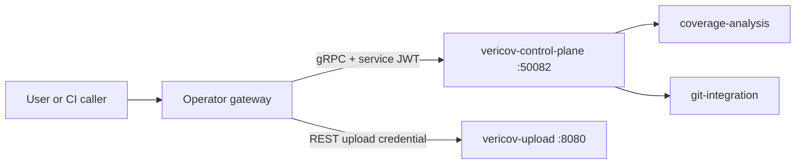

# Gateway Authentication

This document describes how an operator-provided gateway can authenticate users
before calling Vericov services.

## Architecture



The gateway validates end-user identity. Vericov services validate only the
short-lived service JWT that the gateway mints for each delegated call.

## Service JWT

Header:

```json
{ "alg": "RS256", "kid": "<key id>", "typ": "JWT" }
```

Payload:

```json
{
  "iss": "vericov-gateway",
  "aud": "vericov",
  "sub": "user:<verified-user-id>",
  "exp": 1770000000,
  "iat": 1769999700,
  "jti": "<uuid>",
  "vericov_user_id": "<user-uuid>",
  "vericov_scopes": ["repos:read", "reports:write"]
}
```

Rules:

- `exp - iat` must be at most five minutes.
- `aud` must include `vericov`.
- `iss` defaults to `vericov-gateway` and is configurable with `VERICOV_SERVICE_JWT_ISSUER`.
- RS256 public-key verification is preferred through `VERICOV_SERVICE_JWT_PUBLIC_KEY`.
- Private self-hosted deployments may use `VERICOV_SERVICE_JWT_SECRET` for HS256.
- Self-host deployments with no auth setup may set `VERICOV_DEV_AUTH_BYPASS=true` and rely on their private network/gateway boundary.

## Key Rotation

Publish a new public key, update the gateway to mint with the new private key,
then remove the old key after the maximum token lifetime plus clock skew. The
current implementation reads one configured public key per service process;
rotate by updating the environment and restarting services.

## Propagation

Service-to-service calls should propagate the original service JWT rather than
minting a new token. This preserves delegated user and scope context across
control-plane, coverage-analysis, git-integration, integrations, and
agent-runner.

## Service Catalog

The stable namespace for Vericov RPC contracts is `vericov.<service>.v1`.
Current proto scaffolds live under each service's `src/main/proto` directory:

- `vericov.control_plane.v1`
- `vericov.coverage_analysis.v1`
- `vericov.upload.v1`
- `vericov.git.v1`
- `vericov.integrations.v1`
- `vericov.agent_runner.v1`

REST remains for CI coverage uploads, webhook receivers, runner polling, and
browser badge reads.

## Errors

Use standard gRPC status codes:

| Code | Meaning |
| --- | --- |
| `UNAUTHENTICATED` | Missing, expired, malformed, or invalid service JWT |
| `PERMISSION_DENIED` | Valid token without required scope |
| `NOT_FOUND` | Repository/report/resource was not found |
| `INVALID_ARGUMENT` | Request payload failed validation |
| `FAILED_PRECONDITION` | Repository or integration state blocks the operation |
| `INTERNAL` | Unexpected service failure |

HTTP REST endpoints use the existing JSON error envelope.
